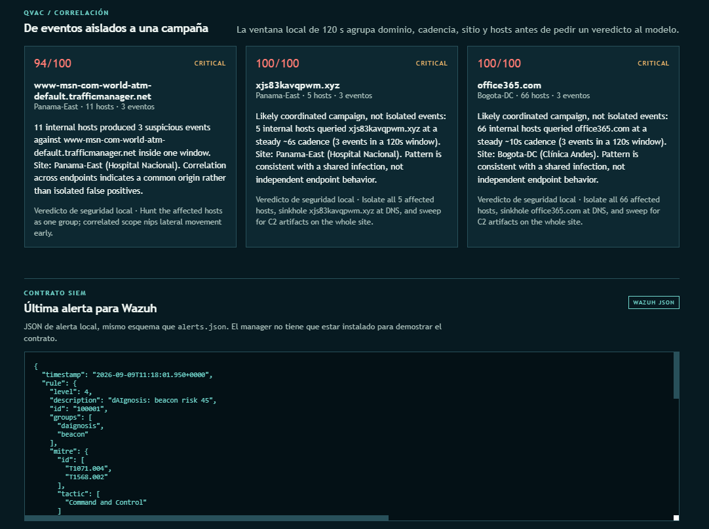
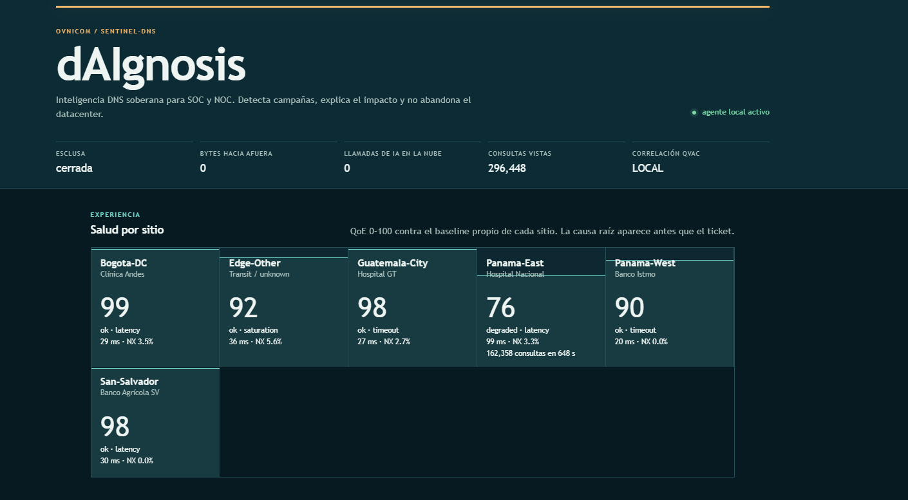
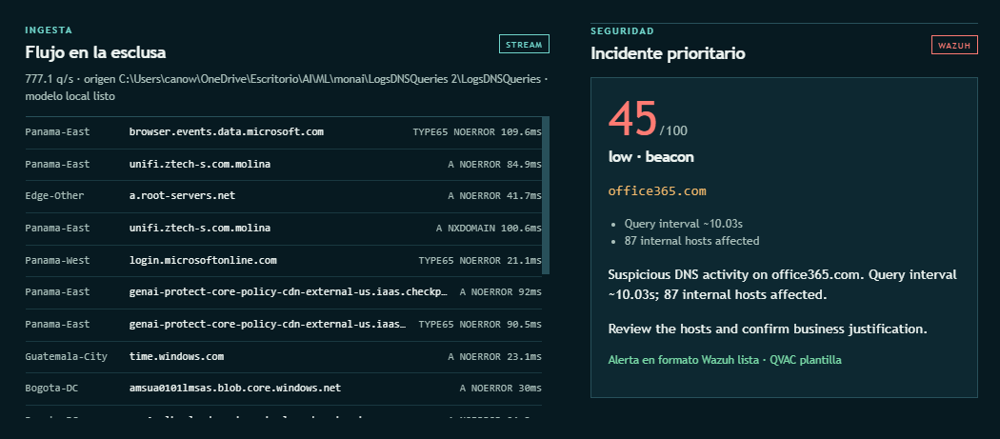

# dAIgnosis


**Una capa de inteligencia DNS soberana.** Usa **QVAC en local** para convertir telemetría DNS en tiempo real en incidentes correlacionados, explicables y diagnóstico proactivo, **100% dentro de la infraestructura del cliente**.



La consola concentra en una sola vista el stream Kafka, la correlación de campañas con QVAC local, la QoE por sitio, la alerta Wazuh y la prueba de cero egreso. Las capturas muestran estas garantías: **QVAC local**, **cero egreso de telemetría** y el recorrido `Kafka → detección → campaña → Wazuh`.





## Pruébalo en 5 minutos

**Con un solo comando** (verifica el air-gap, precarga el modelo QVAC si el SDK está instalado, lanza el demo con tu dataset y abre la consola en el navegador):

```bash
python -m daignosis smoke
```

[Consola: `http://127.0.0.1:8080`](http://127.0.0.1:8080) — sale con `Ctrl+C`.

Sin SDK QVAC todavía, o sin abrir el navegador automáticamente:

```bash
python -m daignosis smoke --no-qvac --no-open
```

### Paso a paso

```bash
cd daignosis
python -m daignosis prove-airgap          # prueba de soberanía: PASS
python -m daignosis demo --data "../LogsDNSQueries 2/LogsDNSQueries"
```

Consola: [http://127.0.0.1:8080](http://127.0.0.1:8080)

Sin dataset, genera tráfico benigno sintético e inyecta la campaña de ejemplo:

```bash
python -m daignosis demo --no-qvac
```

### Consumiendo de Kafka (stream real)

```bash
pip install -r requirements-kafka.txt
python -m daignosis demo --kafka 10.0.0.5:9092,10.0.0.6:9092 --topic dns-queries --group daignosis
```

El guard anti-egreso autoriza **solo** los brokers indicados como fuente de ingesta; todo lo demás sigue bloqueado y analizado.

Para entregar la misma alerta a un relay/API local de Wazuh, añade su endpoint loopback:

```bash
python -m daignosis demo --kafka 127.0.0.1:9092 \
  --wazuh-webhook http://127.0.0.1:55000/daignosis
```

El agente solo acepta endpoints Wazuh locales (`127.0.0.1`, `localhost` o `::1`); una URL pública se rechaza antes de iniciar. Sin `--wazuh-webhook`, la consola conserva el JSON compatible como contrato demostrable sin fingir una entrega al manager.

### Camino completo con la IA local (correlación QVAC real)

```bash
pip install -r requirements-qvac.txt
python -m tetherto.qvac_sdk install-worker
python -m daignosis prefetch    # descarga el modelo antes de la demostración
python -m daignosis demo        # explicación + veredicto de campaña en el dispositivo
```

> Del stream al veredicto: detectar → correlacionar → priorizar → explicar → diagnosticar → mostrar impacto. Sin nube de inferencia.

---

## El problema

Los ataques basados en DNS (DGA, typosquatting, tunneling, beaconing) son baratos de lanzar, difíciles de ver y casi invisibles en los SIEM porque generan miles de alertas sin contexto:

- El **SOC** se ahoga en falsos positivos: revisar y triagear es el coste real de la seguridad, no la detección.
- El **operador de red** no sabe si una caída de rendimiento es un ataque, un resolver mal configurado o una pelea entre proveedores; el cliente se entera **antes que el NOC**.
- El **dato sale de la red**: cualquier analizador "inteligente" sube telemetría a la nube — inaceptable en telecom, finanzas, salud y gobierno.

Hoy hay que elegir: **seguridad en la nube** (entregas tus logs y tu soberanía) o **sin IA** (scripts que generan más ruido del que quitan). dAIgnosis rompe ese dilema.

## La idea de negocio

dAIgnosis es un **sensor on-prem con IA en el dispositivo** que se conecta a los flujos de datos que el operador **ya tiene** (logs BIND o el topic de Kafka de sus resolvers) y se vende como **licencia por sitio** o como **"seguridad DNS como servicio"** para los clientes corporativos del ISP.

**Modelo de negocio:**

| Oferta | Cliente | Valor capturado |
|--------|---------|-----------------|
| Licencia on-prem por resolver/sitio | Operadores, ISPs, grandes empresas | Sin suscripción por API; despliegue sobre infraestructura existente |
| "Seguridad DNS como servicio" empaquetada | ISP → clientes corporativos | Nuevo ingreso recurrente con coste marginal ~0 |
| Correlación + explicación por IA local (QVAC) | SOC | Diferencia el ticket de precio: no es "detecta", es "te dice qué pasó y qué hacer" |
| Diagnóstico de QoE por sitio (pre-decaimiento) | NOC / cliente | Detecta degradación **antes** de tickets; vende SLA |
| Reporte de cumplimiento (cero egreso verificable) | Finanzas, salud, gobierno | Clave de compra en sectores regulados |

**Promesas comerciales demostrables:**

- **Soberanía verificable** → `prove-airgap` prueba que cero bytes salen de `127.0.0.1`. Un operador no compra confianza, compra una prueba ejecutable.
- **IA sin nube (y no cosmética)** → QVAC **correlaciona** las anomalías de la ventana (60–120 s) y decide si hay una campaña coordinada o eventos aislados. Esa transformación —miles de eventos → pocas campañas— es difícil de replicar con reglas fijas y justifica el precio.
- **De alerta a impacto** → cada riesgo se explica y se traduce a negocio: QoE por sitio, consultas afectadas × segundos, SLA.
- **Bajo coste de despliegue** → heurística en stdlib + modelo local sobre **el broker Kafka que el operador ya corre**. Sin mover el data plane ni entrenar modelos.

### Impacto medible (el argumento de venta)

| Métrica | Estado actual típico | Con dAIgnosis |
|---------|----------------------|---------------|
| Alertas que revisa el SOC | miles/día | decenas de incidentes priorizados; 1 veredicto de campaña por cluster |
| Triage por incidente | abrir 4–5 herramientas | explicación y acción recomendada en 1 pantalla |
| Tiempo de diagnóstico de degradación | horas, tras tickets del cliente | segundos desde el evento, causa raíz por sitio |
| Datos fuera de la red | flujo continuo a la nube | 0 bytes (verificable) |

## A quién va dirigido

1. **Operadores de telecom / ISP** — monitorizan sus resolvers y revenden seguridad gestionada (caso del track original).
2. **NOC** — quién quiere saber cuándo el DNS degrada UX y por qué (latencia, cache, NXDOMAIN), antes de que el cliente lo reporte.
3. **SOC empresarial** — priorización + correlación + explicación, no 10.000 eventos crudos.
4. **Sectores regulados (finanzas, salud, gobierno, infraestructura crítica)** — soberanía total e IA on-device son requisito de compra.

## Qué hace el producto

- **Ingiere del stream real**: logs BIND9 (`queries.*`) **o** topics de **Kafka** (texto BIND o JSON), en micro-batches de 512 (~420 q/s) con colas acotadas.
- **Detecta** DGA, typosquatting, tunneling y beaconing con heurística en stdlib (entropy, labels, inter-arrival, EWMA de cadencia).
- **Correlaciona con la IA local**: QVAC recibe las anomalías de los últimos 120 s (dominio, sitios, hosts, cadencias) y **decide campaña vs. eventos aislados**. Es la capa que un SIEM o una regla fija no puede sustituir sin coste.
- **Prioriza** con risk score y veredicto de severidad, no con una lista de timestamps.
- **Diagnostica** root-cause por sitio: degradación por **latencia** vs. por **no-resolución (NXDOMAIN)**, contra el **baseline adaptativo** (EWMA) de cada sitio.
- **Muestra impacto** en negocio: QoE 0–100 con desviación respecto al propio historial del sitio, consultas afectadas × segundos, SLA.
- **Prueba el aislamiento**: un guard de sockets bloquea cualquier salida que no sea loopback (o el broker Kafka configurado como ingesta) y mide `egress_bytes`.

## Cómo funciona (alto nivel)

```
BIND queries.* | Kafka (dns-queries, texto/JSON) | sintético
        → micro-batch 512, cola acotada (~420 q/s)
        → overlay IP→sitio + latencia/RCODE
        → heurística (entropy, labels, inter-arrival) → anomalías → risk ≥ 45
              ├ Incidente → QVAC local explica → alerta SIEM (Wazuh JSON)
              ├ Correlación: mismo dominio+esitio, ≥2 hosts, ventana 120 s
              │     → QVAC decide: ¿campaña coordinada? → alerta de nivel campaña
              └ QoE 5 s / sitio (baseline EWMA + desviación z) → var/*.jsonl
```

QVAC **no** ve cada query; recibe evidencia ya calculada y decisiones difíciles: correlación y narrativa. El dispositivo no vuelca el stream, solo la conclusión.

## Stack y requisitos

- Python ≥ 3.10 · Node.js ≥ 22.17 (worker QVAC) · Opcional: Kafka (`confluent-kafka`), Docker Desktop (ClickHouse + Grafana).
- ClickHouse/Grafana opcionales: `docker compose up -d` (`127.0.0.1:8123` / `127.0.0.1:3000`). Sin Docker, todo queda en `var/qoe.jsonl` y `var/incidents.jsonl` y la consola local lo muestra igual.

## Riesgo de seriedad: origen de los datos

| Qué | Origen | Uso |
|-----|--------|-----|
| Logs BIND9 | Dataset sintético del reto (`LogsDNSQueries`) | Replay del stream. **No son datos de clientes reales.** |
| Overlay latencia / RCODE / customer-site | Generado por este repo (`daignosis/overlay.py`, `config/sites.json`) | Los query logs de BIND no traen latencia ni NXDOMAIN; el QoE usa este overlay declarado. |
| Dominio de campaña `xjs83kavqpwm.xyz` | Inyectado en demo | Escenario de DGA + beacon |
| QVAC SDK / `QWEN3_600M_INST_Q4` | Tether/QVAC | Única inferencia. Local: explicación y correlación de campañas |

## Pruebas

```bash
python -m unittest discover -s tests -v
```

## Licencia

Este proyecto está disponible bajo la [licencia MIT](./LICENSE).